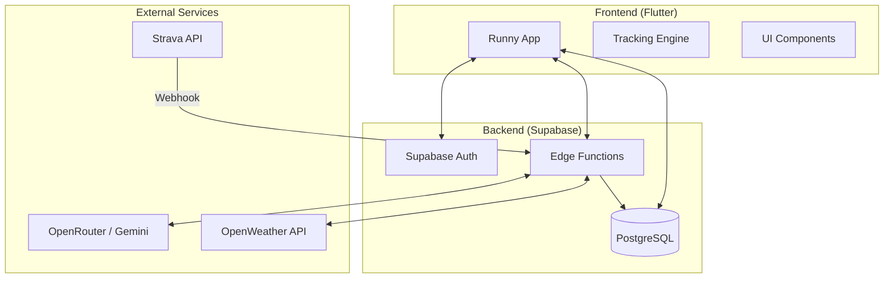

# Runny AI

Runny AI là một hệ sinh thái thể dục thể thao chuyên nghiệp, được hỗ trợ bởi trí tuệ nhân tạo (AI), thiết kế riêng biệt cho cộng đồng những người đam mê chạy bộ. Dự án kết hợp công nghệ theo dõi hoạt động tiên tiến, huấn luyện viên ảo cá nhân hóa và các tính năng tương tác cộng đồng giúp người dùng tối ưu hóa hiệu suất tập luyện.

## Các Tính Năng Cốt Lõi

### 🤖 Huấn Luyện Viên AI (AI Coach)
- **Tư vấn cá nhân hóa**: Trò chuyện tương tác trực tiếp với AI (dựa trên mô hình Llama 3.3/Gemini) để nhận lời khuyên tập luyện và động lực hàng ngày.
- **Phân tích chuyên sâu**: Tự động đánh giá các buổi chạy để tìm ra quy luật, điểm mạnh và các khía cạnh cần cải thiện.
- **Lập kế hoạch tập luyện**: Tự động tạo giáo án chạy bộ dựa trên thể trạng hiện tại và mục tiêu cụ thể của người dùng.

### 🏃 Theo Dõi & Phân Tích (Tracking & Analytics)
- **Định vị GPS**: Ghi lại thời gian thực các thông số: quãng đường, nhịp độ (pace), độ cao và nhịp tim.
- **Lịch sử hoạt động**: Nhật ký tập luyện chi tiết với biểu đồ trực quan và bản đồ hành trình.
- **Đồng bộ hóa bên thứ ba**: Tích hợp liền mạch với Strava để nhập dữ liệu hoạt động lịch sử và tự động đồng bộ trong tương lai.

### 🤝 Cộng Đồng & Trải Nghiệm Game Hóa (Social & Gamification)
- **Bảng xếp hạng**: Thử thách và cạnh tranh cùng cộng đồng dựa trên quãng đường và sự kiên trì.
- **Hệ thống Huy hiệu**: Ghi nhận và vinh danh các cột mốc quan trọng trong hành trình tập luyện.
- **Ghép đôi bạn chạy (Partner Matching)**: Tìm kiếm và kết nối với những người bạn chạy có cùng nhịp độ và khu vực sinh sống.

### 🥗 Sức Khỏe & Dinh Dưỡng
- **Theo dõi cân nặng**: Giám sát xu hướng cân nặng và chỉ số BMI theo thời gian.
- **Tư vấn dinh dưỡng**: Nhận lời khuyên ăn uống dựa trên mức độ vận động thực tế từ AI.

## Kiến Trúc Hệ Thống

## Ảnh Chụp Màn Hình (Demo)

> [!NOTE]
> Các hình ảnh demo giao diện người dùng thực tế đang được tổng hợp và đóng gói cho phiên bản phát hành chính thức (v1.0.0-stable). Trong bản phát hành thử nghiệm v0.1.0-alpha, bạn có thể chạy thử trực tiếp giao diện ứng dụng bằng cách làm theo hướng dẫn cài đặt dưới đây.

## Tài liệu Hướng dẫn

- [Tầm nhìn Sản phẩm, Personas & User Stories](docs/product-vision.md)
- [Hướng dẫn Cài đặt](docs/setup.md)
- [Tài liệu API](docs/api.md)
- [Danh mục Công nghệ](docs/tech-stack.md)
- [Kiến trúc Hệ thống](docs/architecture.md)

---
Được phát triển với ❤️ dành cho cộng đồng Chạy bộ.
