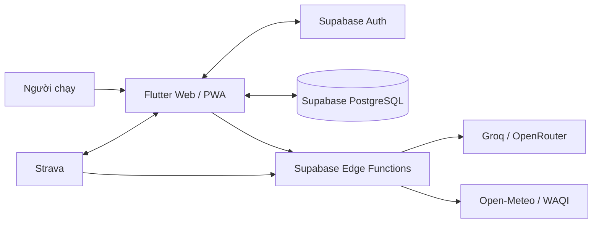

<p align="center">
  <a href="https://runny-ai.onrender.com/">
    
  </a>
</p>

<h1 align="center">Runny AI</h1>

<p align="center">
  Trợ lý chạy bộ cá nhân kết hợp dữ liệu tập luyện, AI Coach và cộng đồng.
</p>

<p align="center">
  <a href="https://runny-ai.onrender.com/"><strong>Trải nghiệm web app</strong></a>
  ·
  <a href="docs/setup.md">Cài đặt</a>
  ·
  <a href="docs/architecture.md">Kiến trúc</a>
  ·
  <a href="docs/api.md">API</a>
</p>

<p align="center">
  
  
  
</p>

<p align="center">
  <a href="https://unikorn.vn/p/runny-ai?ref=embed-runny-ai" target="_blank"></a>
  <a href="https://unikorn.vn/p/runny-ai?ref=embed-runny-ai" target="_blank"></a>
  <a href="https://unikorn.vn/p/runny-ai?ref=embed-runny-ai" target="_blank"></a>
</p>

## Chạy thông minh hơn, đều đặn hơn

Runny AI là nền tảng huấn luyện chạy bộ dành cho người chạy ở mọi cấp độ. Ứng dụng biến lịch sử chạy, mục tiêu cá nhân, mức độ hồi phục và điều kiện thời tiết thành những gợi ý dễ hành động — từ buổi chạy hôm nay đến một giáo án dài hạn.

Ứng dụng web đang được triển khai tại **[runny-ai.onrender.com](https://runny-ai.onrender.com/)**.

## Điểm nổi bật

| | Tính năng | Bạn nhận được |
| --- | --- | --- |
| 🤖 | **AI Coach theo ngữ cảnh** | Trò chuyện bằng văn bản hoặc giọng nói với huấn luyện viên AI; câu trả lời có thể dùng ngữ cảnh hoạt động, lịch tập, readiness và thời tiết hiện tại. |
| 🗓️ | **Giáo án cá nhân hóa** | Tạo kế hoạch theo mục tiêu, theo dõi lịch tập, xem insight tuần và dời buổi tập khi cần. |
| ❤️ | **Readiness & hồi phục** | Ước tính mức sẵn sàng từ tải tập ngắn/dài hạn, ACWR và tín hiệu đau/mệt để hỗ trợ quyết định nên tập, giảm tải hay nghỉ. |
| 📈 | **Phân tích hoạt động** | Khám phá pace, nhịp tim, elevation, split và lịch sử tập qua biểu đồ trực quan; lưu kèm điều kiện thời tiết và AQI khi có dữ liệu vị trí. |
| ⬆️ | **Nhập hoạt động linh hoạt** | Kết nối Strava, nhập GPX/FIT, điền thủ công hoặc tải ảnh chụp kết quả để AI trích xuất số liệu trước khi lưu. |
| 🥗 | **Dinh dưỡng & thể trạng** | Ghi nhật ký dinh dưỡng, nhận gợi ý phù hợp tải tập, theo dõi cân nặng/BMI và nhận diện món ăn từ ảnh. |
| 👟 | **Quản lý giày chạy** | Theo dõi số kilomet tích lũy của từng đôi giày và nhận cảnh báo khi đến ngưỡng cần thay. |
| 🤝 | **Cộng đồng chạy bộ** | Chia sẻ hoạt động, kết nối bạn chạy, theo dõi bảng xếp hạng và các cột mốc huy hiệu. |

## Giao diện

<p align="center">
  
  
  
  
</p>

## Công nghệ & nguyên tắc bảo mật



- **Flutter + Provider** cung cấp trải nghiệm đa nền tảng, hỗ trợ giao diện sáng/tối và tiếng Việt/English.
- **Supabase** đảm nhiệm xác thực, PostgreSQL với Row Level Security, realtime và Edge Functions.
- Các yêu cầu tới AI và thời tiết được đi qua Edge Functions; khóa nhà cung cấp không được đưa vào web client. AI proxy ưu tiên Groq và có thể fallback sang OpenRouter.
- **Strava OAuth + webhook** hỗ trợ kết nối và đồng bộ hoạt động.

## Bắt đầu phát triển

Yêu cầu: Flutter SDK (Dart `^3.12.0`), một dự án Supabase và cấu hình môi trường cho client/backend. Xem hướng dẫn đầy đủ tại **[docs/setup.md](docs/setup.md)**.

```bash
git clone <repository-url>
cd runny-ai/apps/runny_app
cp .env.example .env
flutter pub get
flutter run -d chrome
```

Tệp `.env` phía client chỉ chứa `SUPABASE_URL`, `SUPABASE_ANON_KEY` và các model hint không nhạy cảm. Các khóa AI, thời tiết và Strava phải được đặt ở Supabase Edge Functions — không thêm chúng vào ứng dụng Flutter.

Các lệnh thường dùng:

```bash
# Từ apps/runny_app/
flutter analyze
flutter test
flutter build web --release

# Từ thư mục gốc dự án, dành cho môi trường phát triển local
supabase start
supabase db reset
supabase functions serve --env-file supabase/functions/.env
```

## Cấu trúc repository

```text
apps/runny_app/       Flutter client: pages, widgets, models và services
supabase/             Database migrations, seed data và Deno Edge Functions
content-factory/      Nguồn/asset marketing và ảnh demo dùng trong README
docs/                 Tài liệu kiến trúc, API, thiết lập và tầm nhìn sản phẩm
```

## Tài liệu

- [Tầm nhìn sản phẩm, personas & user stories](docs/product-vision.md)
- [Hướng dẫn cài đặt và cấu hình](docs/setup.md)
- [Tài liệu API](docs/api.md)
- [Kiến trúc hệ thống](docs/architecture.md)
- [Danh mục công nghệ](docs/tech-stack.md)
- [Ghi chú phát hành v0.1.0](release_notes_v0.1.0.md)

## Trạng thái dự án

Runny AI hiện ở giai đoạn **alpha**. Một số dịch vụ phụ thuộc cấu hình Supabase, nhà cung cấp AI, vị trí thiết bị hoặc tài khoản Strava để hoạt động đầy đủ.

## License

Phát hành theo [MIT License](LICENSE).

---

Được xây dựng với niềm yêu thích dành cho cộng đồng chạy bộ. 🏃
