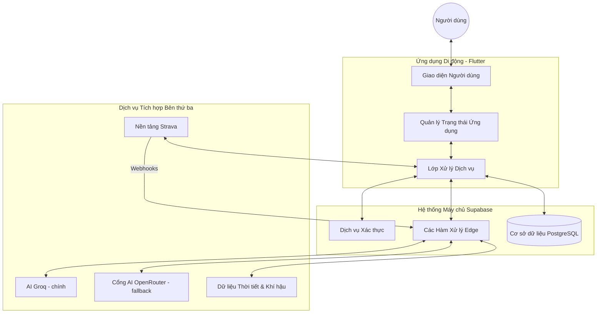

# Kiến trúc Hệ thống

Runny AI vận hành dựa trên kiến trúc không máy chủ (Serverless), tận dụng tối đa sức mạnh của Flutter và Supabase để mang lại trải nghiệm thời gian thực mượt mà cho người dùng.

## Sơ đồ Kiến trúc Tổng thể

## Các Quy trình Nghiệp vụ Chính

### 1. Chu trình Phân tích và Huấn luyện AI
1. **Kích hoạt**: Sau khi người dùng hoàn thành buổi chạy hoặc gửi thắc mắc tại trang Huấn luyện viên AI.
2. **Thu thập Ngữ cảnh**: Ứng dụng tổng hợp dữ liệu hoạt động (quãng đường, tốc độ, nhịp tim) và thông tin cá nhân.
3. **Yêu cầu Xử lý**: Hệ thống gửi dữ liệu tới hàm xử lý Edge để kết nối với các mô hình ngôn ngữ lớn — ưu tiên Groq, tự fallback sang OpenRouter khi cần.
4. **Lưu trữ & Phản hồi**: Kết quả phân tích được lưu trữ vào cơ sở dữ liệu và hiển thị trực quan cho người dùng.

### 2. Đồng bộ hóa Hoạt động với Strava
- **Xác thực**: Người dùng kết nối tài khoản Strava qua chuẩn bảo mật OAuth2.
- **Cập nhật Tức thời**: Khi có hoạt động mới trên Strava, hệ thống sẽ nhận thông báo qua cơ chế Webhook và tự động đồng bộ dữ liệu về máy chủ dự án.

### 3. Tương tác Cộng đồng và Thi đua
- **Bảng xếp hạng**: Dữ liệu được tính toán và cập nhật liên tục dựa trên hiệu suất tập luyện thực tế của toàn bộ cộng đồng.
- **Thành tích & Huy hiệu**: Hệ thống tự động ghi nhận và trao tặng huy hiệu khi người dùng đạt được các cột mốc quan trọng trong quá trình chạy bộ.
